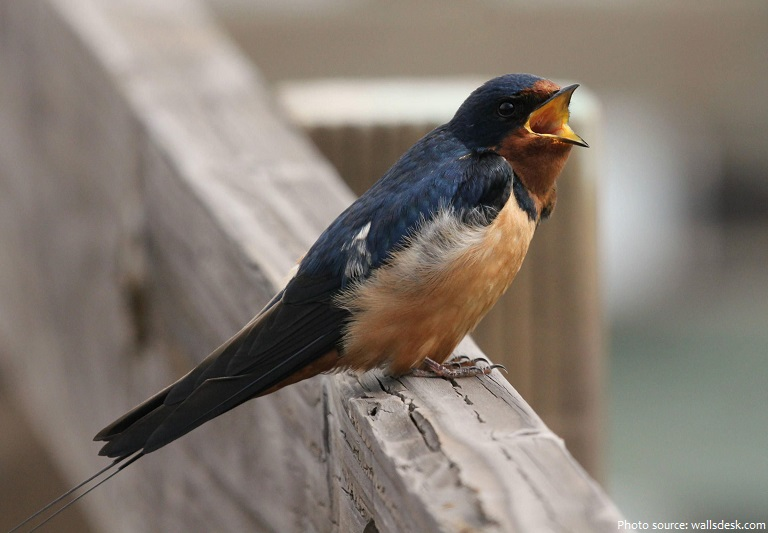

<html><head><meta http-equiv="Content-Type" content="text/html; charset=windows-1252">
        <title>Index.html</title>
      
</head>
	<body>
    	<h1>The African Swallow</h1>
    	<h2>By Davis Conway</h2>
    		

			<form style="display: inline" action="https://www.hbw.com/ibc/species/57759/gallery" method="get">
				
<button>Photos of African Swallow</button>

  			</form>
			
 What is the African Swallow? That very question has baffled zoologists since 1975, when 
				Monty Python first included the question "What is the average airspeed velocity and
				unladend swallow?" Since then,
					scientists all over the world have attempted to uncover the truth behind the African Swallow,
					yet they have been unsuccesful in their search for the truth. I am here to settle this debate
					that has ravaged the scientific world for decades. Below, I have compared the wingspan and 
						average airspeed of the European and African swallow.

		<table id="t01" border="2" class="right">
		<tbody><tr>
			<th>Type of Swallow</th><th> South African Cliff Swallow</th><th>European Swallow</th>
		</tr>
		<tr>
			<td> Wingspan</td><td>28-30cm</td><td>12.2cm</td>
		</tr><tr>
			<td> Average Airspeed</td><td>14 m/s</td><td>11 m/s</td>
		</tr></tbody></table>
		 
 Thankfully, the average airspeed of the European Swallow is common knowledge, however, none have
			cracked the unsolvable formula that would allow us to determine the average airspeed of the African Swallow.
			Well, that is until now. Through many hours of intensive calculations, I have arrived at 14 m/s, or 3 m/s
			faster than the European Swallow. 

       
		 
 Now that we have concluded that the African Swallow is faster than the European Swallow, I would like to pose
			3 questions:

			 <ol id="l01">
  				<li> Could a Swallow carry two coconuts across an ocean? </li>
 				<li> If not, how did King Arthur come across the coconuts he uses to mimic riding a horse?</li>
				<li> How long could a swallow fly if it was to fly at its average airspeed? </li>
			</ol>
		 
<b>If you wish to learn more about the Swallow, I would recommend this site: </b> <a href="http://www.imdb.com/title/tt0071853/"> Monty Python and the Holy Grail IMDB</a>

	
</body></html>
